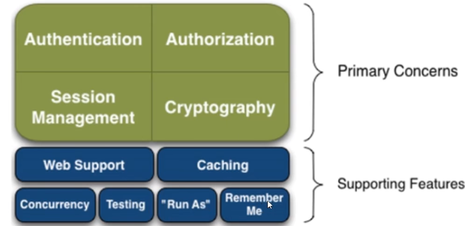

# Shiro

## 功能



## QuickStart
```java
// 对应的是SerurityManager部分
// 将shiro.ini绑定SecurityManager
DefaultSecurityManager defaultSecurityManager = new DefaultSecurityManager();
IniRealm iniRealm = new IniRealm("classpath:shiro.ini");
defaultSecurityManager.setRealm(iniRealm);
// 绑定securityManager
SecurityUtils.setSecurityManager(defaultSecurityManager);

// 对应的是图中的Subject部分
Subject currentUser = SecurityUtils.getSubject();

// 获取当前用户的session
Session session = currentUser.getSession();
// shiro的session具有存放值的功能
session.setAttribute("someKey", "aValue");
String value = (String) session.getAttribute("someKey");
if (value.equals("aValue")) {
    log.info("Retrieved the correct value! [" + value + "]");
}

// let's login the current user so we can check against roles and permissions:
if (!currentUser.isAuthenticated()) {
    // 新建用户名 密码令牌实例
    UsernamePasswordToken token = new UsernamePasswordToken("lonestarr", "vespa");
    // 设置记住我
    token.setRememberMe(true);
    try {
        // 执行登录操作
        currentUser.login(token);
    } catch (UnknownAccountException uae) {
        // 未知账户操作
        log.info("There is no user with username of " + token.getPrincipal());
    } catch (IncorrectCredentialsException ice) {
        // 不正确的认证
        log.info("Password for account " + token.getPrincipal() + " was incorrect!");
    } catch (LockedAccountException lae) {
        // 账户锁定错误
        log.info("The account for username " + token.getPrincipal() + " is locked.  " +
                 "Please contact your administrator to unlock it.");
    }
    // ... catch more exceptions here (maybe custom ones specific to your application?
    catch (AuthenticationException ae) {
        //unexpected condition?  error?
        ae.printStackTrace();
    }
}

//say who they are:
//print their identifying principal (in this case, a username):
log.info("User [" + currentUser.getPrincipal() + "] logged in successfully.");

//test a role:
if (currentUser.hasRole("schwartz")) {
    log.info("May the Schwartz be with you!");
} else {
    log.info("Hello, mere mortal.");
}

// 相对粗粒度的操作
//test a typed permission (not instance-level)
if (currentUser.isPermitted("lightsaber:wield")) {
    log.info("You may use a lightsaber ring.  Use it wisely.");
} else {
    log.info("Sorry, lightsaber rings are for schwartz masters only.");
}

// 相对细粒度的操作
//a (very powerful) Instance Level permission:
if (currentUser.isPermitted("winnebago:drive:eagle5")) {
    log.info("You are permitted to 'drive' the winnebago with license plate (id) 'eagle5'.  " +
             "Here are the keys - have fun!");
} else {
    log.info("Sorry, you aren't allowed to drive the 'eagle5' winnebago!");
}

//all done - log out!
currentUser.logout();

System.exit(0);
```
三大对象
1. subject:用户
2. SecurityManager 管理所有用户
3. Relam: 链接数据

**内置过滤器**
anon: 无需认证 访问
authc: 必须认证才能访问
user: 必须拥有记住我功能才能用
perms: 拥有某个资源权限才能访问
role: 拥有某个角色权限才能访问

## 开发中遇到的错误
```shell
2022-02-10 21:21:35.323  INFO 15384 --- [           main] c.s.s.ShiroTutorialApplication           : Starting ShiroTutorialApplication using Java 17.0.2 on MI with PID 15384 (C:\Users\laoha\Desktop\XUEXI\Learn\Java\Netty\LearnShiro\ShiroTutorial\target\classes started by laoha in C:\Users\laoha\Desktop\XUEXI\Learn\Java\Netty\LearnShiro)
2022-02-10 21:21:35.325  INFO 15384 --- [           main] c.s.s.ShiroTutorialApplication           : No active profile set, falling back to default profiles: default
2022-02-10 21:21:35.970  INFO 15384 --- [           main] trationDelegate$BeanPostProcessorChecker : Bean 'org.apache.shiro.spring.boot.autoconfigure.ShiroBeanAutoConfiguration' of type [org.apache.shiro.spring.boot.autoconfigure.ShiroBeanAutoConfiguration$$EnhancerBySpringCGLIB$$1083f1d3] is not eligible for getting processed by all BeanPostProcessors (for example: not eligible for auto-proxying)
2022-02-10 21:21:35.981  INFO 15384 --- [           main] trationDelegate$BeanPostProcessorChecker : Bean 'org.apache.shiro.spring.boot.autoconfigure.ShiroAnnotationProcessorAutoConfiguration' of type [org.apache.shiro.spring.boot.autoconfigure.ShiroAnnotationProcessorAutoConfiguration$$EnhancerBySpringCGLIB$$13173078] is not eligible for getting processed by all BeanPostProcessors (for example: not eligible for auto-proxying)
2022-02-10 21:21:36.002  INFO 15384 --- [           main] trationDelegate$BeanPostProcessorChecker : Bean 'shiroConfig' of type [com.sin.shirotutorial.config.ShiroConfig$$EnhancerBySpringCGLIB$$5fb77211] is not eligible for getting processed by all BeanPostProcessors (for example: not eligible for auto-proxying)
2022-02-10 21:21:36.019  INFO 15384 --- [           main] trationDelegate$BeanPostProcessorChecker : Bean 'userRealm' of type [com.sin.shirotutorial.config.UserRealm] is not eligible for getting processed by all BeanPostProcessors (for example: not eligible for auto-proxying)
2022-02-10 21:21:36.069  INFO 15384 --- [           main] trationDelegate$BeanPostProcessorChecker : Bean 'getDefaultWebSecurityManager' of type [org.apache.shiro.web.mgt.DefaultWebSecurityManager] is not eligible for getting processed by all BeanPostProcessors (for example: not eligible for auto-proxying)
2022-02-10 21:21:36.087  INFO 15384 --- [           main] trationDelegate$BeanPostProcessorChecker : Bean 'authorizationAttributeSourceAdvisor' of type [org.apache.shiro.spring.security.interceptor.AuthorizationAttributeSourceAdvisor] is not eligible for getting processed by all BeanPostProcessors (for example: not eligible for auto-proxying)
2022-02-10 21:21:36.092  INFO 15384 --- [           main] trationDelegate$BeanPostProcessorChecker : Bean 'eventBus' of type [org.apache.shiro.event.support.DefaultEventBus] is not eligible for getting processed by all BeanPostProcessors (for example: not eligible for auto-proxying)
2022-02-10 21:21:36.384  INFO 15384 --- [           main] o.s.b.w.embedded.tomcat.TomcatWebServer  : Tomcat initialized with port(s): 8080 (http)
2022-02-10 21:21:36.394  INFO 15384 --- [           main] o.apache.catalina.core.StandardService   : Starting service [Tomcat]
2022-02-10 21:21:36.394  INFO 15384 --- [           main] org.apache.catalina.core.StandardEngine  : Starting Servlet engine: [Apache Tomcat/9.0.56]
2022-02-10 21:21:36.477  INFO 15384 --- [           main] o.a.c.c.C.[Tomcat].[localhost].[/]       : Initializing Spring embedded WebApplicationContext
2022-02-10 21:21:36.477  INFO 15384 --- [           main] w.s.c.ServletWebServerApplicationContext : Root WebApplicationContext: initialization completed in 1109 ms
2022-02-10 21:21:36.539 ERROR 15384 --- [           main] o.s.b.web.embedded.tomcat.TomcatStarter  : Error starting Tomcat context. Exception: org.springframework.beans.factory.BeanCreationException. Message: Error creating bean with name 'filterShiroFilterRegistrationBean' defined in class path resource [org/apache/shiro/spring/config/web/autoconfigure/ShiroWebFilterConfiguration.class]: Bean instantiation via factory method failed; nested exception is org.springframework.beans.BeanInstantiationException: Failed to instantiate [org.springframework.boot.web.servlet.FilterRegistrationBean]: Factory method 'filterShiroFilterRegistrationBean' threw exception; nested exception is org.springframework.beans.factory.NoSuchBeanDefinitionException: No bean named 'shiroFilterFactoryBean' available
2022-02-10 21:21:36.557  INFO 15384 --- [           main] o.apache.catalina.core.StandardService   : Stopping service [Tomcat]
2022-02-10 21:21:36.565  WARN 15384 --- [           main] ConfigServletWebServerApplicationContext : Exception encountered during context initialization - cancelling refresh attempt: org.springframework.context.ApplicationContextException: Unable to start web server; nested exception is org.springframework.boot.web.server.WebServerException: Unable to start embedded Tomcat
2022-02-10 21:21:36.573  INFO 15384 --- [           main] ConditionEvaluationReportLoggingListener : 

Error starting ApplicationContext. To display the conditions report re-run your application with 'debug' enabled.
2022-02-10 21:21:36.590 ERROR 15384 --- [           main] o.s.b.d.LoggingFailureAnalysisReporter   : 
```
最主要是这一句:[com.sin.shirotutorial.config.UserRealm] is not eligible for getting processed by all BeanPostProcessors (for example: not eligible for auto-proxying)
